## 22-03-27-깃블로그만들기

## 목차

> 1.포크뜨기
>
> 2.레포지토리 이름 변경하기
>
> 3.깃로컬로 Clone하기
>
> 4.로컬 환경 설정
>
> > 4.1 에러가 난다면?
>
> 5.블로그사용하기
>
> 6.Configuration하기
>
> 7.배포하기
>
> 8.동작확인 해보기

## 1.포크뜨기
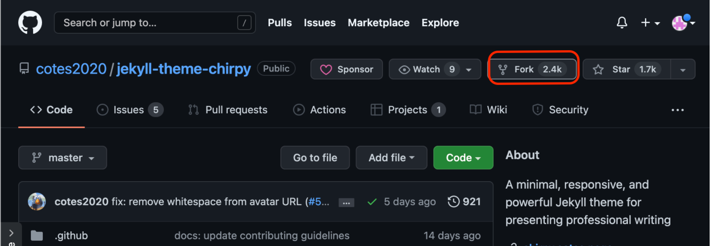

- 우선 저기 깃을 로그인한 상태에서 해당 [링크](https://github.com/cotes2020/jekyll-theme-chirpy)를 들어간다.
  - 그리고 Fork를 클릭한다.

## 2.레포지토리 이름 변경하기

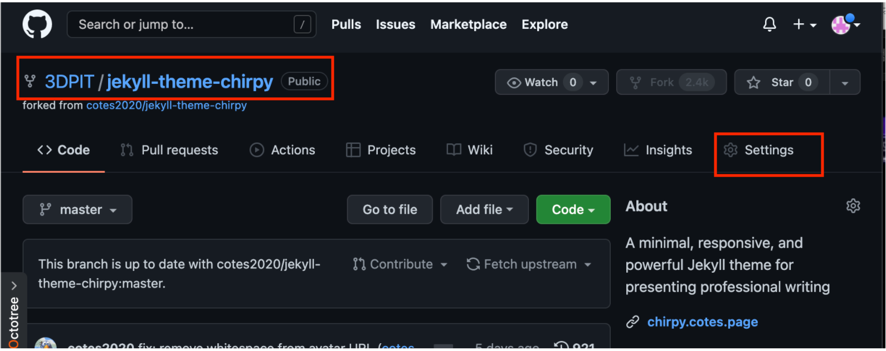

- 포크를 누르면 내 레포지토리에 저렇게 포크가 떠지는데 여기서 Settings를 클릭하자

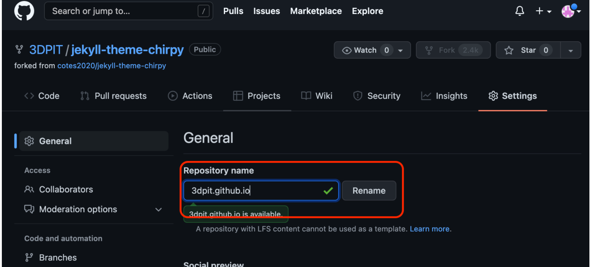

- 그리고 이름을 변경한다.
- 내깃이름.github.io
  - 저의 경우 3dpit이 깃이름이므로
    - `3dpit.github.io`가 된다.

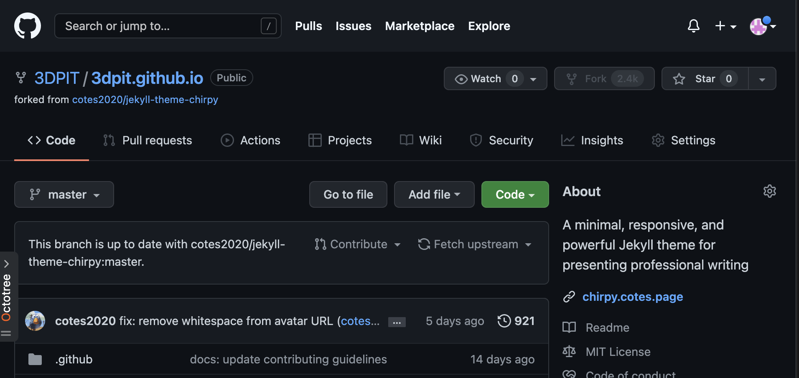

- 위 는 변경된 모습이다.

## 3.깃로컬로 Clone하기

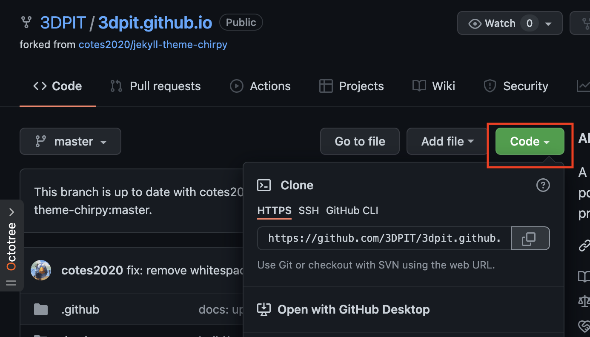

- code 부분을 클릭하면 저렇게 clone할 https가 있음 저걸 복사함
- 그리고 원하는 디렉토리에 git clone https링크 -b master --single-branch
  - 위를 터미널창에 입력후 clone해 온다.


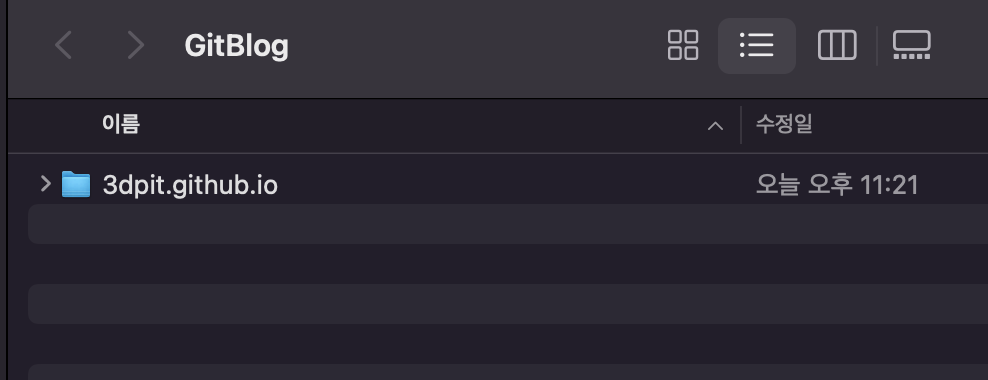

- 저렇게 받아지면 성공임

## 4.로컬 환경 설정

```sh
ruby -v
gem -v
gcc -v ## g++ -v, make -v
```

- 자신의 운영체제에 맞게 세가지가 설치되어 있어야함

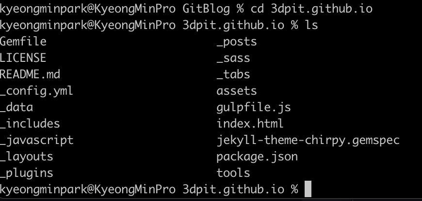

- 레포지토리 경로로 들어가서 아래 명령어를 입력한다.
  - `bundle install`
    - 위를 입력하면 dependencies들이 자동으로 설치된다.

### 4.1 에러가 난다면?

위 명령어에서 `can't find bundler`와 같은 에러가 발생하였다면

- Update RubyGems:
  `$ gem update --system` 을 통해 루비젬을 업데이트해주거나
- Install the exact Bundler:
  `$ gem install bundler -v "$(grep -A 1 "BUNDLED WITH" Gemfile.lock | tail -n 1)"` 명령어로 설치하는 방법이 있음

## 5.블로그사용하기

- 프로젝트 폴더로 이동해서 아래 명령어를 이용해서 초기화 하자

  - `bash tools/init.sh`

  

> Note: 깃허브 페이지에 배포하는 것을 원하지 않는 경우 뒤에 `--no-gh`옵션을 붙여서 실행하자.

위 의 명령어로 실행되는 것

- 1.특정파일과 폴더 삭제

  - .travis.yml
  - _posts폴더 속 파일들
  - docs폴더

- 2.--no-gh 옵션을 붙인 경우 `.github`폴더가 삭제

  - 그렇지 않는 경우
    - .github/workflows/pages-deploy.yml.hook의  `.hook`확장자 파일을 삭제 함으로써
      - Github Action workflow를 셋업할 수 있다.

  - 그 후에는 .github폴더의 다른 파일, 폴더들을 삭제됨

## 6.Configuration하기

- _config.yml파일에서 여러가지 설정값들을 고정해주자.

- `url`: 블로그의 주소를 넣어주면 된다.
  e.g. `url: 'https://j1mmyson.github.io'`
- `avatar`: 대표사진으로 쓰일 이미지 파일을 넣으면된다. 일반적으로 이미지 파일은 `../../assets/img/`폴더에 넣고 불러쓴다.
  e.g. `avatar: ../../assets/img/byungwook.png`
- `timezone`: [Find your timezone](http://www.timezoneconverter.com/cgi-bin/findzone/findzone)에서 자신이 속한 지역을 찾아 넣으면 된다.
  e.g. `timezone: Asia/Seoul`
- `theme_mode`: 블로그의 테마모드를 설정해주는 값. 다크와 라이트중 선택할 수 있다.
  e.g. `theme_mode: dark`

## 7.배포하기

- 배포하기전 제대로 동작하는지 확인을 위해 아래 명령어를 입력해보자.
  - `bundle exec jekyll sbundle exec jekyll s`

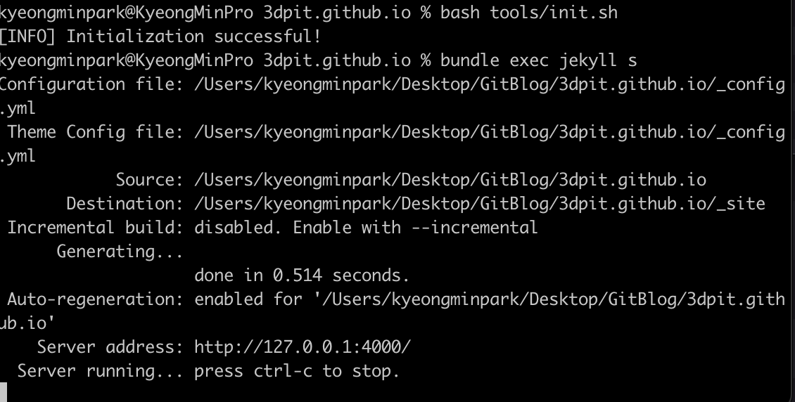

- 해당 서버로 들어가서 확인해보자

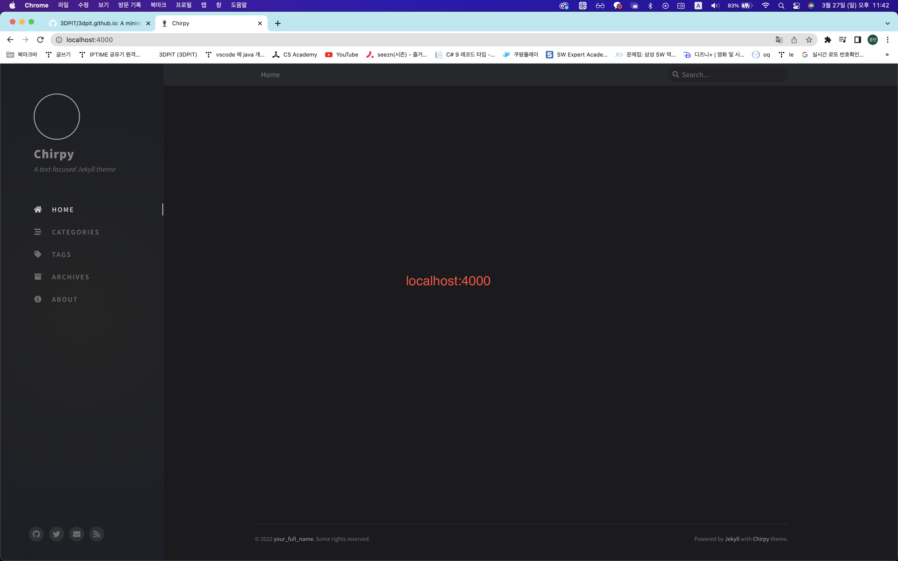

- localhost:4000

  - 위를 입력해서 들어가보자 그럼 위와 같이 나올것이다 그럼 성공이다.

- 이 상태를 우선 깃 푸시를 해준다.

  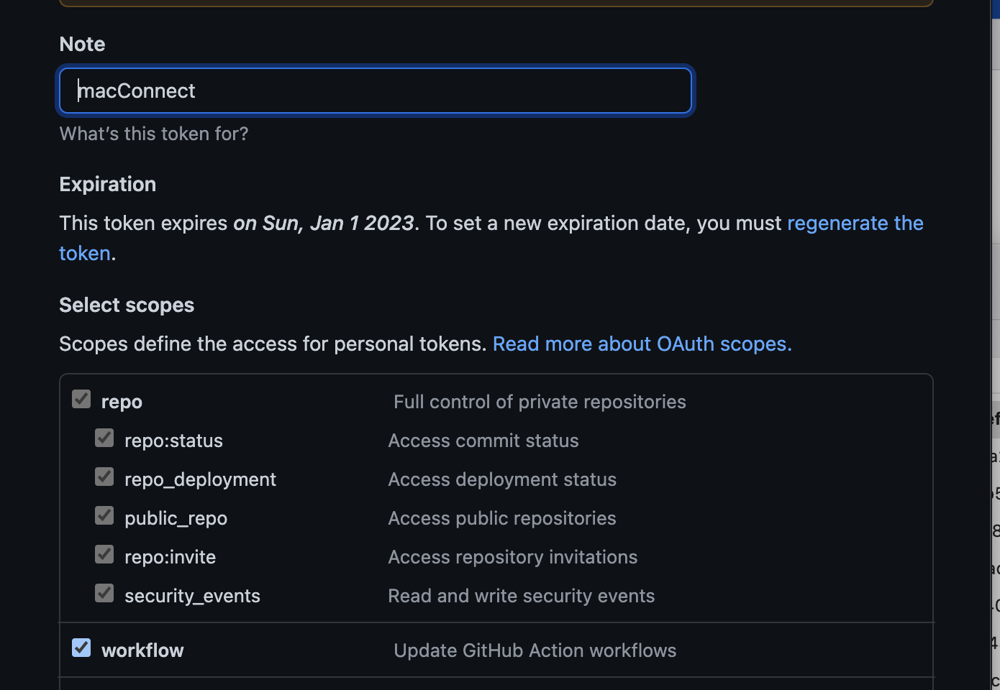

  - 중요한건 이제 토큰이 없으면 푸쉬가 안되는데 여기서 workflow가 체크되어 있어야 푸쉬가 된다

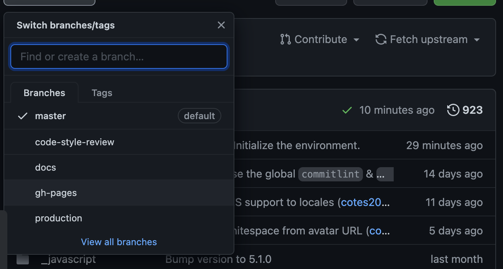

- 제대로 되면 저렇게 브랜치에 `gh-page`가 있음

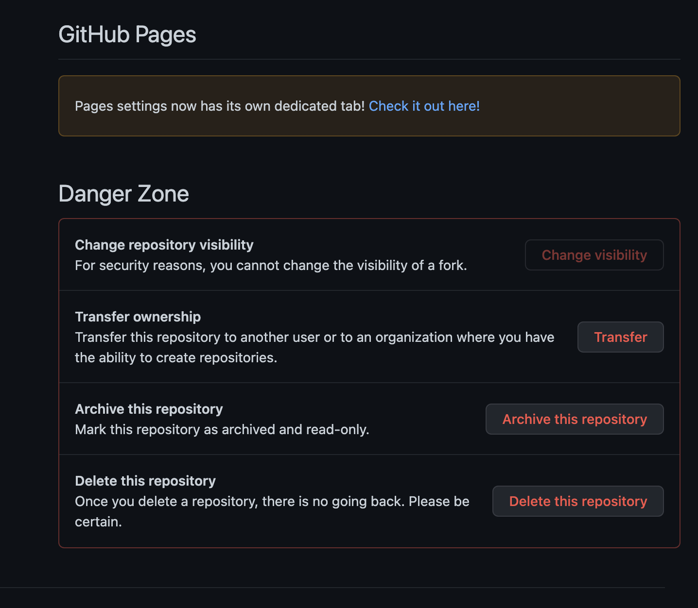


- 레포지토리에 settings에서 쭉 내려가면 github pasges가 있음 저거에서 
  - Check it out here클릭

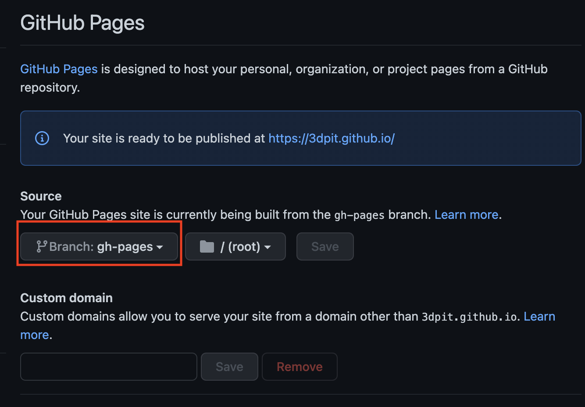

- 브랜치를 gh-pages로 해주고 save클릭하면됨

## 8.동작확인 해보기

- _post/폴더에 마크다운 작성하여 깃허브에 푸쉬하면 포스팅이 되는것을 확인할 수 있음

